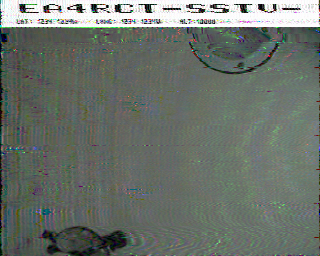
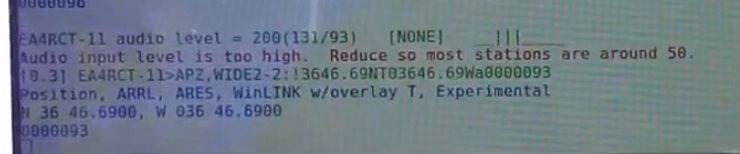

# Arduino SSTV APRS emitter

SSTV APRS emitter using arduino Due. If you are interested only in SSTV part, its [here](https://git.radio.clubs.etsit.upm.es/SSTV-Encoder/SSTV-arduino-scottie1). Otherwise, if you are interested on APRS part its [here](https://git.radio.clubs.etsit.upm.es/SSTV-Encoder/APRS-aduino).

### Hardware used

Hardware used on this code is:
* [Adafruit JPEG TTL Camera](https://www.adafruit.com/product/397)
* [Synthesizer AD9850](https://es.aliexpress.com/item/32970951398.html?src=google&src=google&albch=shopping&acnt=494-037-6276&isdl=y&slnk=&plac=&mtctp=&albbt=Gploogle_7_shopping&aff_atform=google&aff_short_key=UneMJZVf&&albagn=888888&albcp=1821185973&albag=69002407349&trgt=854439011708&crea=es32970951398&netw=u&device=c&albpg=854439011708&albpd=es32970951398&gclid=Cj0KCQjw-_j1BRDkARIsAJcfmTFjdzy1Jt5RXunA-dfDz4Hp8_kSOubMVn214dcltLNzv-rP8igKQMMaAvhxEALw_wcB&gclsrc=aw.ds)
* [Adafruit Ultimate GPS MTK3339](https://www.adafruit.com/product/746)
* [Pololu AltIMU-10 v5](https://www.pololu.com/product/2739)
* Arduino Due
* Arduino SD module

### Results

APRS test using Direwolf:

